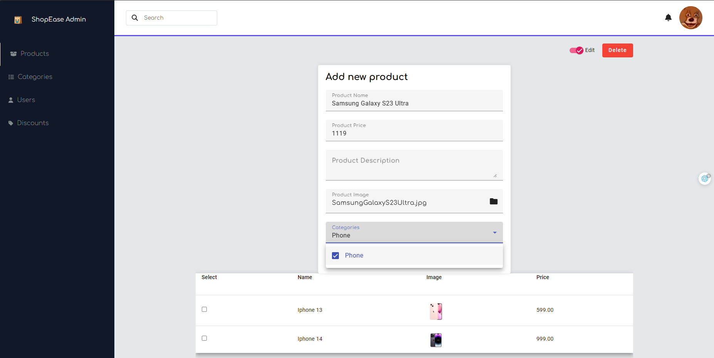
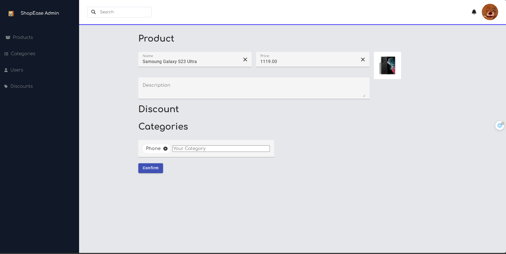
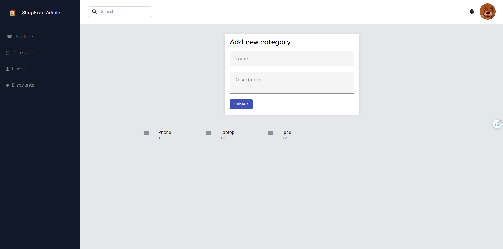
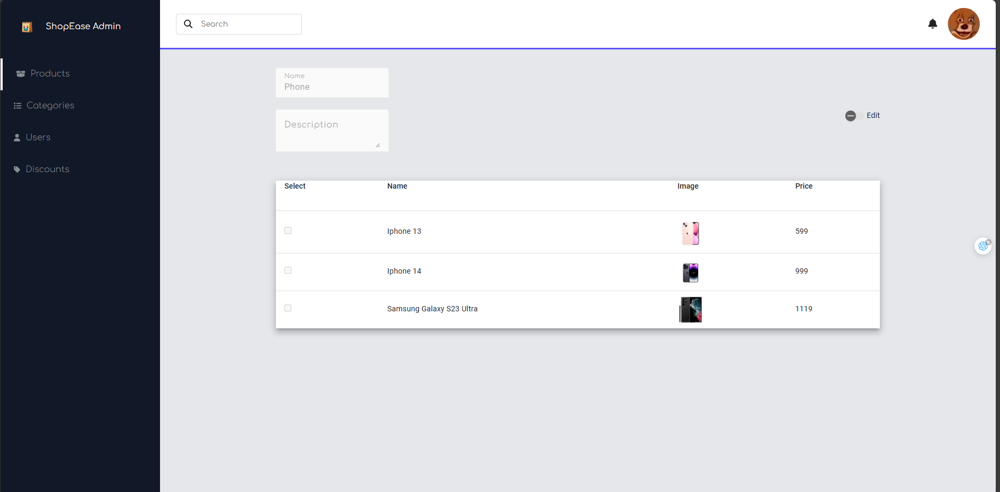
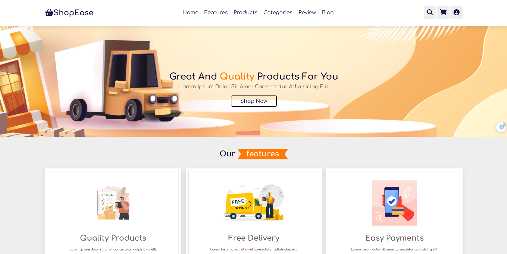
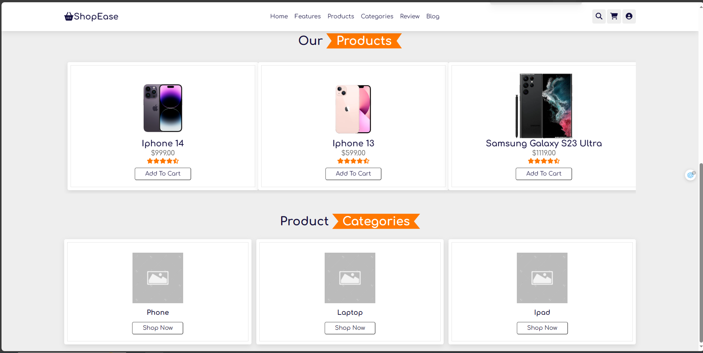
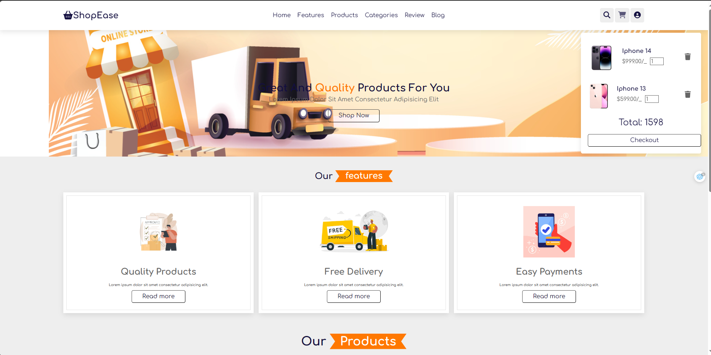
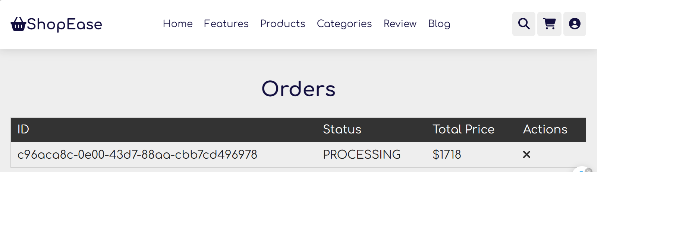
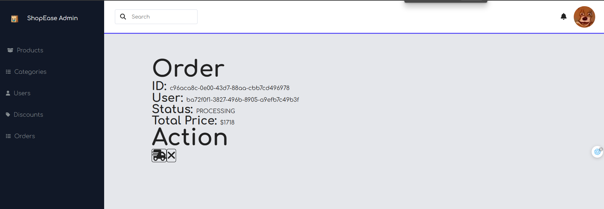

# SHOPEASE ECOMMERCE

- Build with: Angular, NestJS

## Showcase

- Server: [Github Link](https://github.com/minercreepmc/product-catalog)
- Client for Admin: [Github Link](https://github.com/minercreepmc/shop-ease-dashboard)
- Client for User: [Github Link](https://github.com/minercreepmc/shop-ease-client)
### Use Cases
- Create, Update, Delete, Get Product 
- Create, Update, Delete, Get Category
- Create, Update, Delete, Get Discount
- Manage relationship between Product, Category and Discount.
- Register, Login as Member for User Client and Login as Admin for Admin Dashboard
- Checkout and Manage Order 

### Example Checkout Process

##### We can login to the admin dashboard and start to manage

##### Add product along with category

- In the client, we can register an account and login, then add to cart and checkout

- Order will appear in both client and admin

User can cancel order

Admin can change to shipping state or cancelled state due to some reason (out of stock,..)

