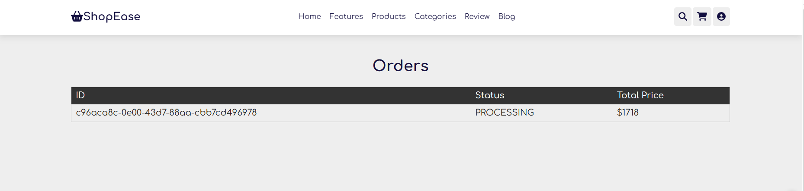
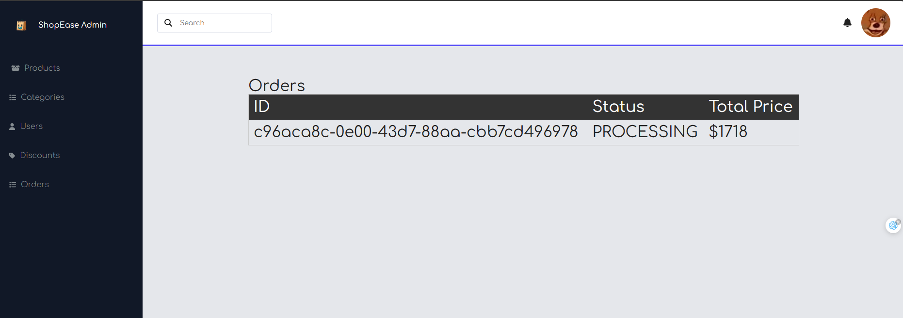

# SHOPEASE ECOMMERCE

- Build with: Angular, NestJS

## Showcase

- Server: [Github Link](https://github.com/minercreepmc/product-catalog)
- Client for Admin: [Github Link](https://github.com/minercreepmc/shop-ease-dashboard)
- Client for User: [Github Link](https://github.com/minercreepmc/shop-ease-client)

### Process

##### We can login to the admin dashboard and manage 

##### Add product along with category

- In the client, we can register an account and login, then add to cart and checkout

- Order will appear in both client and admin

